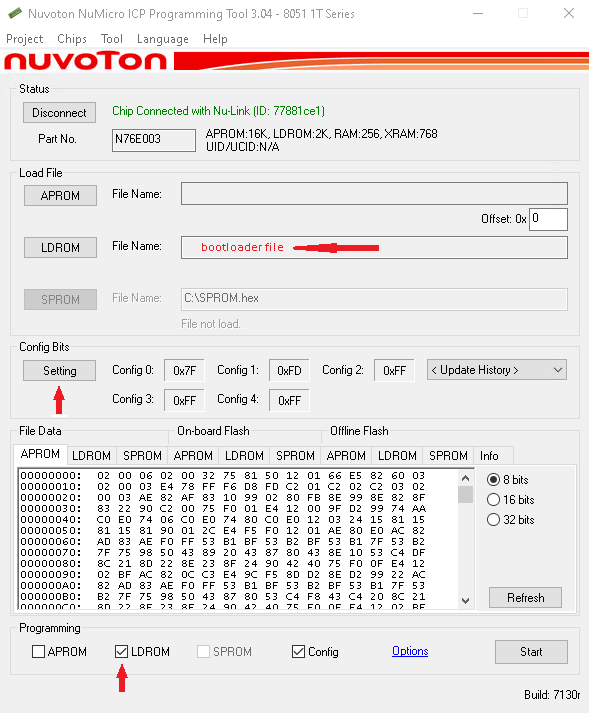
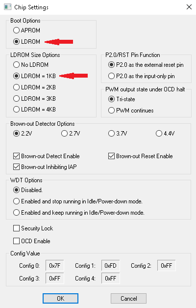

## N76E003 and MS51xx Bootloader

### Install the Bootloader

After compiled use the Nuvoton's ICP programming tool to install the bootloader in the LDROM portion of the flash memory as shown in the image below.\
Don't forget to mark the LDROM option on the "Programming" section and dismark the APROM if it is not necessary.

Press the "Setting" button and modify the boot option and LDROM size accordingly

## N76flash utility

This is the command line used to program the chip from now own, the only mandatory option is the file that should be in **binary** format. \
When the flash programming is initiated is required to reset the microcontroller when asked, in order to access the bootloader process.
